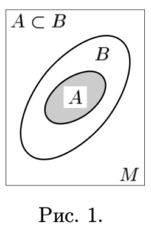
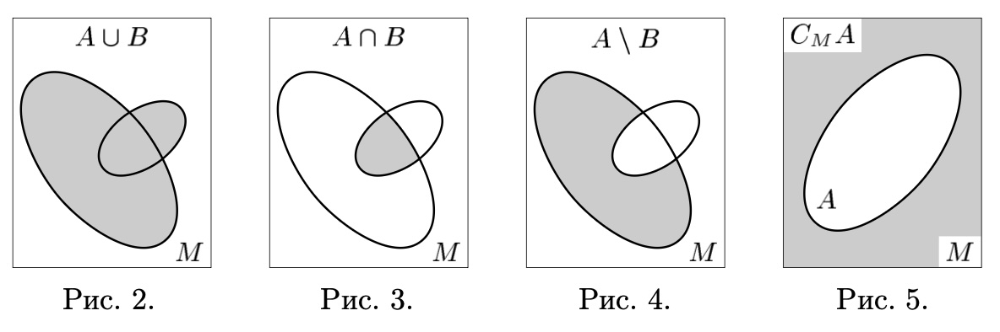

# Множество

## Содержание

- [Множество](#множество)
  - [Содержание](#содержание)
  - [Понятие множества](#понятие-множества)
    - [Наивное понимание](#наивное-понимание)
    - [Парадокс Рассела](#парадокс-рассела)
    - [Современное понимание](#современное-понимание)
  - [Отношения включения](#отношения-включения)
  - [Простейшие операции над множествами](#простейшие-операции-над-множествами)
  - [Законы де Моргана](#законы-де-моргана)

## Понятие множества

С конца XIX – начала XX столетия наиболее универсальным языком математики стал язык теории множеств. Это проявилось даже в одном из определений математики как науки, изучающей различные структуры (отношения) на множествах (Бурбаки Н. «Архитектура математики»).

### Наивное понимание

«Под множеством мы понимаем объединение в одно целое определенных, вполне различимых объектов нашей интуиции или нашей мысли» — так описал понятие «множество» Георг Кантор, основатель теории множеств.

Описание Кантора, разумеется, нельзя назвать определением, поскольку оно апеллирует к понятиям, быть может, более сложным (во всяком случае, не определенным ранее), чем само понятие множества.

Слова «класс», «семейство», «совокупность», «набор» в наивной теории множеств употребляют как синонимы термина «множество».

Если $x$ — объект, $P$ — свойство, $P(x)$ — обозначение того, что $x$ обладает свойством $P$, то через $\{x|P(x)\}$ обозначают весь класс объектов, обладающих свойством $P$. Объекты, составляющие класс или множество, называют _элементами_ класса или множества.

Множество, состоящее из элементов $x_1, ... , x_n$, обычно обозначают как $\{x_1,...,x_n\}$. Там, где это не вызывает недоразумения, для сокращения записи мы позволяем себе обозначать одноэлементное множество ${a}$ просто через $a$.

### Парадокс Рассела

[↑ Парадокс Рассела](ttps://ru.wikipedia.org/wiki/Парадокс_Рассела) — теоретико-множественный парадокс ([↑ антиномия](https://ru.wikipedia.org/wiki/Антиномия)), открытый в 1901 году [Бертраном Расселом](../математика/математики.md#рассел-бертран) и демонстрирующий противоречивость логической системы [Фреге](../математика/математики.md#фреге-готлоб), являвшейся ранней попыткой формализации наивной теории множеств [Георга Кантора](../математика/математики.md#кантор-георг).

На неформальном языке парадокс можно описать следующим образом. Условимся называть множество «обычным», если оно не является своим собственным элементом. Например, множество всех людей является «обычным», так как само множество — не человек. Примером «необычного» множества является [↑ множество всех множеств](https://ru.wikipedia.org/wiki/Универсальное_множество), так как оно само является множеством, а следовательно, само является собственным элементом.

Можно рассмотреть множество, состоящее только из всех «обычных» множеств, такое множество называется _расселовским множеством_. Парадокс возникает при попытке определить, является ли это множество «обычным» или нет, то есть содержит ли оно себя в качестве элемента. Есть две возможности.

С одной стороны, если оно «обычное», то оно должно включать себя в качестве элемента, так как оно по определению состоит из всех «обычных» множеств. Но тогда оно не может быть «обычным», так как «обычные» множества — это те, которые себя не включают.

Остаётся предположить, что это множество «необычное». Однако оно не может включать себя в качестве элемента, так как оно по определению должно состоять только из «обычных» множеств. Но если оно не включает себя в качестве элемента, то это «обычное» множество.

В любом случае получается противоречие.

### Современное понимание

В существующих аксиоматических теориях множество определяется как математический объект, обладающий определенным набором свойств.

Описание этих свойств составляет аксиоматику. Ядром аксиоматики теории множеств является постулирование правил, по которым из множеств можно образовывать новые множества. В целом любая из существующих аксиоматик такова, что она, с одной стороны, избавляет от известных противоречий наивной теории, а с другой — обеспечивает свободу оперирования с конкретными множествами, возникающими в различных отделах математики, и в первую очередь именно в математическом анализе, понимаемом в широком смысле слова.

## Отношения включения

Высказывание «$x$ есть элемент множества $X$» коротко обозначают символом

$$x \in X \qquad (или \; X \ni x)$$

а его отрицание — символом

$$x \notin X \qquad (или \; X \notni x).$$

В записи высказываний о множествах часто используются логические операторы $\exists$ «существует» или «найдется») и $\forall$ («любой» или «для любого»), называемые кванторами _существования_ и _всеобщности_ соответственно.

Например, запись $\forall x \; ((x \in A) \Leftrightarrow (x \in B))$ означает, что для любого объекта $x$ соотношения $x \in A$ и $x \in B$ равносильны. Поскольку множество вполне определяется своими элементами, указанное высказывание принято обозначать короткой записью

$$A = B,$$

читаемой «$A$ равно $B$», обозначающей совпадение множеств $A$ и $B$.

Таким образом, два множества равны, когда они состоят из одних и тех же элементов.

Отрицание равенства обычно записывают в виде $A \neq B$.

Если любой элемент множества $A$ является элементом множества $B$, то пишут $A \subset B$ или $B \supset A$ и говорят, что множество A является _подмножеством_ множества $B$, или что $B$ содержит $A$, или что $B$ включает в себя $A$. В связи с этим отношение $A \subset B$ между множествами $A$, $B$ называется _отношением включения_ (рис. 1).

Если $A \subset B$ и $A \neq B$, то будем говорить, что включение $A \subset B$ _строгое_ или что $A$ — _собственное_ подмножество $B$.

Если $M$ — множество, то любое свойство $P$ выделяет в $M$ подмножество

$$\{ x \in M | P(x) \}$$

тех элементов M, которые обладают этим свойством.

Например, очевидно, что

$$M = \{ x \in M |  x \in M \}.$$

С другой стороны, если в качестве $P$ взять свойство, которым не обладает ни один элемент множества $M$, например $P(x) := (x  \neq x)$, то мы получим множество

$$\varnothing = \{ x \in M |  x \neq x \},$$

называемое _пустым_ подмножеством множества $M$.

## Простейшие операции над множествами

Пусть $A$ и $B$ — подмножества множества $M$.

**a.** _Объединением_ множеств $A$ и $B$ называется множество

$$A \cup B := \{ x \in M | (x \in A) \lor (x∈B) \},$$

состоящее из тех и только тех элементов множества $M$, которые содержатся хотя бы в одном из множеств $A$, $B$ (рис. 2).

**b.** _Пересечением_ множеств $A$ и $B$ называется множество

$$A∩B := \{ x \in M | (x \in A) \land (x \in B) \},$$

образованное теми и только теми элементами множества $M$, которые принадлежат одновременно множествам $A$ и $B$ (рис. 3).

**c.** _Разностью_ между множеством $A$ и множеством $B$ называется множество

$$A \setminus B := \{ x \in M | (x \in A) \land (x \notin B) \},$$

состоящее из тех элементов множества $A$, которые не содержатся в множестве $B$ (рис. 4).

Разность между множеством $M$ и содержащимся в нем подмножеством обычно называют _дополнением_ $A$ в $M$ и обозначают через $C_MA$ или $CA$, когда из контекста ясно, в каком множестве ищется дополнение к $A$ (рис. 5).

## Законы де Моргана

[↑ **Законы де Моргана**](https://ru.wikipedia.org/wiki/Законы_де_Моргана) — логические правила, связывающие пары логических операций при помощи логического отрицания.

Названы в честь [Августа де Моргана](../математика/математики.md#морган-август-де).

В краткой форме звучат так:

- Отрицание конъюнкции есть дизъюнкция отрицаний.
- Отрицание дизъюнкции есть конъюнкция отрицаний.
