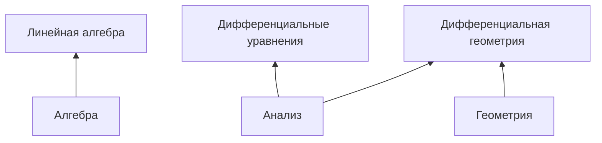

# Математика. Разделы математики

## Содержание

- [Математика. Разделы математики](#математика-разделы-математики)
  - [Содержание](#содержание)
  - [Математика](#математика)
  - [Дерево высшей математики](#дерево-высшей-математики)
  - [Математика как учебная дисциплина](#математика-как-учебная-дисциплина)
    - [Элементарная математика](#элементарная-математика)
      - [Арифметика](#арифметика)
      - [Элементарная алгебра](#элементарная-алгебра)
    - [Высшая математика](#высшая-математика)
  - [Алгебра](#алгебра)
  - [Геометрия](#геометрия)
  - [Анализ](#анализ)
    - [Математический анализ](#математический-анализ)
    - [Дифференциальное исчисление](#дифференциальное-исчисление)
    - [Интегральное исчисление](#интегральное-исчисление)
  - [Теория чисел](#теория-чисел)

## Математика

**Математика** (греч. `mathematike`, от `máthema` — знание, наука) — наука о количественных отношениях и пространственных формах действительного мира.

Три основных направления математики:

- [алгебра](#алгебра)
- [геометрия](#геометрия)
- [анализ](#анализ)

## Дерево высшей математики

[↑ Рисую дерево высшей математики](https://www.youtube.com/watch?app=desktop&v=6yL2DU8hrSM).

## Математика как учебная дисциплина

Математика как учебная дисциплина подразделяется в Российской Федерации на [элементарную математику](#элементарная-математика), изучаемую в средней школе и [высшую математику](#высшая-математика), изучаемую в вузе.

[Универсальная десятичная комбинация, PDF-файл](udc.pdf).

### Элементарная математика

**Элементарная математика** — несколько неопределённое понятие, охватывающее те разделы математики, которые изучаются в средней школе.

Дисциплины, составляющие элементарную математику:

- [Арифметика](#арифметика)
- [Элементарная алгебра](#элементарная-алгебра)
- Элементарная геометрия: планиметрия и стереометрия
- Теория элементарных функций и элементы анализа

В России обучение математике начинается с первого класса. В начальной школе изучается арифметика, то есть правила оперирования с числами. С 7 класса начинается разделение обучения математики на алгебру и геометрию, которая в свою очередь подразделяется на планиметрию и стереометрию. На уроках изучаются задания с модулями, формулы сокращённого умножения.

В старших классах в России даются элементы анализа и теории элементарных функций, в частности проходится исследование функций. С 1970-х усиливается влияние идей проникновения «современной математики» в школу.

#### Арифметика

**Арифметика** (греч. `arithmetike`, от `arithmos` — число) — наука о числах, в первую очередь о натуральных числах и рациональных дробях, и действиях над ними.

В арифметике рассматриваются измерения, вычислительные операции (сложение, вычитание, умножение, деление) и приёмы вычислений.

Арифметика является древнейшей и одной из основных математических наук; она тесно связана с [алгеброй](#алгебра), [геометрией](#геометрия) и [теорией чисел](#теория-чисел).

#### Элементарная алгебра

**Элементарная алгебра** — это центральная часть алгебры, изучаемая в средней школе.

В ней рассматриваются математические утверждения с использованием переменных для неопределенных значений. Она стремится определить, для каких значений эти утверждения верны. Для этого используются различные методы преобразования уравнений для выделения переменных.

Кроме букв и чисел, в формулах элементарной алгебры используются арифметические операции (сложение, вычитание, умножение, деление, возведение в степень, извлечение корня) и элементарные функции (логарифм, тригонометрические функции). Две формулы, соединённые знаком равенства, называются уравнением.

### Высшая математика

**Высшая математика** — курс математики, изучаемый в ВУЗе.

Дисциплины, входящие в состав высшей математики, варьируются в зависимости от специальности. В связи с запросами современной техники курс высшей математики имеет тенденцию к расширению.

Программа обучения по специальности математика образована следующими учебными дисциплинами:

- Математический анализ
- Алгебра
- Аналитическая геометрия
- Линейная алгебра и геометрия
- Дискретная математика
- Математическая логика
- Дифференциальные уравнения
- Дифференциальная геометрия
- Топология
- Функциональный анализ и интегральные уравнения
- Теория функций комплексного переменного
- Уравнения в частных производных
- Теория вероятностей
- Математическая статистика
- Теория случайных процессов
- Вариационное исчисление и методы оптимизации
- Методы вычислений, то есть численные методы
- Теория чисел

## Алгебра

[**Алгебра**](https://ru.wikipedia.org/wiki/Алгебра) — раздел математики, изучающий алгебраические структуры и манипуляции с высказываниями в рамках этих структур.

Это обобщение [арифметики](#арифметика), в котором вводятся переменные и алгебраические операции, отличные от стандартных арифметических операций, таких как сложение и умножение.

## Геометрия

## Анализ

[↑ **Анализ**](<https://ru.wikipedia.org/wiki/Анализ_(раздел_математики)>) — объединение нескольких разделов математики, исторически выросшее из классического [математического анализа](#математический-анализ) и охватывающее, кроме [дифференциального](#дифференциальное-исчисление) и [интегрального исчислений](#интегральное-исчисление), входящих в классическую часть, такие разделы, как теории функций вещественной и комплексной переменной, теории дифференциальных и интегральных уравнений, вариационное исчисление, гармонический анализ, функциональный анализ, теорию динамических систем и эргодическую теорию, глобальный анализ.

> [↑ Analysis](https://en.wikipedia.org/wiki/Mathematical_analysis) is the branch of mathematics dealing with continuous functions, limits, and related theories, such as differentiation, integration, measure, infinite sequences, series, and analytic functions.
>
> — Википедия

Анализ считается одним из трёх основных направлений математики, наряду с [алгеброй](#алгебра) и [геометрией](#геометрия). Основной отличительный признак анализа в сравнении с другими направлениями — наличие функций переменных величин как предмета исследования. При этом, если элементарные разделы анализа в учебных программах и материалах часто объединяют с элементарной алгеброй (например, существуют многочисленные учебники и курсы с наименованием «Алгебра и начала анализа»), то современный анализ в значительной степени использует методы современных геометрических разделов, прежде всего, дифференциальной геометрии и топологии.

### Математический анализ

**[↑ Математический анализ](https://ru.wikipedia.org/wiki/Математический_анализ)** или **классический математический анализ** — совокупность разделов математики, соответствующих историческому разделу под наименованием [↑ «анализ бесконечно малых»](https://ru.wikipedia.org/wiki/Анализ_бесконечно_малых), объединяет [дифференциальное](#дифференциальное-исчисление) и [интегральное исчисления](#интегральное-исчисление).

На классическом математическом анализе основывается современный анализ, который рассматривается как одно из трёх основных направлений математики (наряду с алгеброй и геометрией). При этом термин «математический анализ» в классическом понимании используется, в основном, в учебных программах и материалах. В англо-американской традиции классическому математическому анализу соответствуют программы курсов с наименованием «исчисление» (англ. `calculus`).

> [↑ Calculus](https://en.wikipedia.org/wiki/Calculus) is the mathematical study of continuous change, in the same way that geometry is the study of shape, and algebra is the study of generalizations of arithmetic operations.
>
> — Википедия

### Дифференциальное исчисление

[↑ **Дифференциальное исчисление**](https://ru.wikipedia.org/wiki/Дифференциальное_исчисление) — раздел [математического анализа](#математический-анализ), в котором изучаются понятия _производной_ и _дифференциала_ и способы их применения к исследованию _функций_.

### Интегральное исчисление

[↑ **Интегральное исчисление**](https://ru.wikipedia.org/wiki/Интегральное_исчисление) — раздел [математического анализа](#математический-анализ), в котором изучаются _интеграл_, его свойства и методы вычислений.

## Теория чисел

**Теория чисел** или **высшая арифметика** — раздел математики, первоначально изучавший свойства [целых чисел](неразобранное/число.md#целое-число).

В современной теории чисел рассматриваются и другие типы чисел — например, алгебраические и трансцендентные, а также функции различного происхождения, которые связаны с арифметикой целых чисел и их обобщений.
