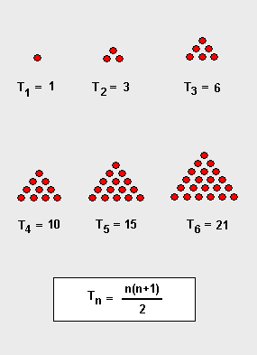

# Число

**Число** — одно из основных понятий математики, используемое для количественной характеристики, сравнения, нумерации объектов и их частей.

## Содержание

- [Число](#число)
  - [Содержание](#содержание)
  - [Натуральное число](#натуральное-число)
    - [Факторизация натуральных чисел](#факторизация-натуральных-чисел)
    - [Основная теорема арифметики](#основная-теорема-арифметики)
  - [Целое число](#целое-число)
  - [Действительное число](#действительное-число)
  - [Рациональное число](#рациональное-число)
  - [Иррациональное число](#иррациональное-число)
  - [Простое число](#простое-число)
  - [Составное число](#составное-число)
  - [Полный квадрат](#полный-квадрат)
  - [Квадрат числа](#квадрат-числа)
  - [Треугольное число](#треугольное-число)

## Натуральное число

**Натуральные числа** (от лат. `naturalis` «естественный») — числа, возникающие естественным образом при счёте: $1,\ 2,\ 3,\ 4,\ 5,\ 6,\ 7$ и так далее.

Последовательность всех натуральных чисел, расположенных в порядке возрастания, называется *натуральным рядом*.

Множество всех натуральных чисел принято обозначать символом $\mathbb{N}$.

Существуют два подхода к определению натуральных чисел:

1) числа, возникающие при счёте (нумерации) предметов: первый, второй, третий, четвёртый, пятый…
2) числа, возникающие при обозначении количества предметов: $0$ предметов, $1$ предмет, $2$ предмета, $3$ предмета, $4$ предмета, $5$ предметов…

В первом случае ряд натуральных чисел начинается с единицы, во втором — с нуля. Не существует единого для большинства математиков мнения о предпочтительности первого или второго подхода (то есть считать ли ноль натуральным числом или нет). В подавляющем большинстве российских источников традиционно принят первый подход.

Второй подход, например, применяется в трудах Никола Бурбаки, где натуральные числа определяются как мощности конечных множеств. Наличие нуля облегчает формулировку и доказательство многих теорем арифметики натуральных чисел, поэтому при первом подходе вводится полезное понятие расширенного натурального ряда, включающего ноль.

### Факторизация натуральных чисел

**Факторизацией** натурального числа называется его разложение в произведение простых множителей.

Существование и единственность такого разложения следует из [основной теоремы арифметики](#основная-теорема-арифметики).

### Основная теорема арифметики

Основная теорема арифметики:

> Всякое натуральное число, больше единицы, представимо в виде произведения простых чисел, причём единственным способом с точностью до порядка следования сомножителей.

Таким образом, простые числа — «элементарные строительные блоки» натуральных чисел.

## Целое число

**Целые числа** — расширение множества натуральных чисел, получаемое добавлением к нему нуля и отрицательных чисел.

Необходимость рассмотрения целых чисел продиктована невозможностью в общем случае вычесть из одного натурального числа другое — можно вычитать только меньшее число из большего. Введение нуля и отрицательных чисел делает вычитание такой же полноценной операцией, как сложение.

Вещественное число является целым, если его десятичное представление не содержит дробной части (но может содержать знак). Примеры вещественных чисел:

- Числа $142857;\ 0;\ −273$ являются целыми.
- Числа $5½;\ 9,75$ не являются целыми.

Множество целых чисел обозначается $\mathbb{Z}$  (от нем.`Zahlen` — «числа»).

## Действительное число

**Действительными** или **вещественными числами** называются все положительные числа, отрицательные числа и нуль.

Множество действительных чисел объединяет в себе множество [рациональных](#рациональное-число) и [иррациональных чисел](#иррациональное-число).

Обозначается множество действительных чисел $\mathbb{R}$.

Пример: $\dfrac{2}{3};\ 0,754;\ -23;\ -\dfrac{5}{4};\ 113;\ -\sqrt[3]{2};\ -2,34;\ \dfrac{1}{\pi}$

## Рациональное число

**Рациональное число** (от лат. ratio «отношение, деление, дробь») — число, которое можно представить в виде обыкновенной дроби $\dfrac {m}{n}$, где $m$ — [целое число](#целое-число), а $n$ — натуральное.

Пример: $\dfrac {2}{3}$, где $m=2$, а $n=3$.

## Иррациональное число

**Иррациональное число** — это вещественное число, которое не является [рациональным](#рациональное-число), то есть не может быть представлено в виде обыкновенной дроби $\dfrac {m}{n}$, где $m, n$ — целые числа, $n \neq 0$. Иррациональное число может быть представлено в виде бесконечной непериодической десятичной дроби.

Другими словами, множество иррациональных чисел есть разность $\mathbb{I} = \mathbb{R} \backslash \mathbb{Q}$ множеств вещественных и рациональных чисел.

Иррациональными являются, среди прочих, отношение длины окружности к диаметру круга (число $\pi$), основание натурального логарифма $e$, золотое сечение $\phi$, квадратный корень из двух. Все квадратные корни [натуральных чисел](#натуральное-число), кроме полных квадратов, иррациональны.

## Простое число

**Простое число** — это натуральное число, больше единицы, имеющее ровно два натуральных делителя: $1$ и само себя.

Изучением свойств простых чисел занимается теория чисел.

## Составное число

**Составное число** — натуральное число, имеющее делители, отличные от единицы и самого себя.

Каждое составное число является произведением двух или более [натуральных чисел](#натуральное-число), больших единицы. Все натуральные числа делятся на три непересекающиеся категории: [простые](#простое-число), составные и единица.

## Полный квадрат

**Полный квадрат**, также **точный квадрат** или **квадратное число**, — число, являющееся [квадратом](#квадрат-числа) некоторого целого числа. Иными словами, квадратом является целое число, квадратный корень из которого извлекается нацело. Геометрически такое число может быть представлено в виде площади квадрата с целочисленной стороной.

Например, $9$ — это квадратное число, так как оно может быть записано в виде $3 × 3$, а также представляет площадь квадрата со стороной, равной $3$.

Квадратное число входит в категорию классических [↑ фигурных чисел](https://ru.wikipedia.org/wiki/Фигурные_числа).

[↑ Полный квадрат](https://ru.wikipedia.org/wiki/Полный_квадрат).

## Квадрат числа

**Квадрат числа** $x$ — результат умножения числа на себя $x \cdot x$. Обозначение: $x^2$.

Вычисление $x^{2}$ — [↑ математическая операция](https://ru.wikipedia.org/wiki/Операция_(математика)), называемая **возведением в квадрат**. Эта операция представляет собой частный случай [↑ возведения в степень](https://ru.wikipedia.org/wiki/Возведение_в_степень), а именно — возведение числа $x$ в степень $2$.

Начало числовой последовательности для квадратов целых неотрицательных чисел:

$0, 1, 4, 9, 16, 25, 36, 49, 64, 81, 100, 121, 144, 169, 196, 225, 256, 289, 324, 361, 400, 441, \ldots$

## Треугольное число

**Треугольное число** — один из классов фигурных многоугольных чисел, определяемый как число точек, которые могут быть расставлены в форме правильного треугольника.

Как видно из рисунка, $n$-е треугольное число $T_{n}$ — это сумма $n$ первых натуральных чисел:

$$
\begin{array}{ll}
T_1=1 & =1 \\
T_2=1+2 & =3 \\
T_3=1+2+3 & =6 \\
T_4=1+2+3+4 & =10
\end{array}
$$

и т. д. Общая формула для $n$-го по порядку треугольного числа:

$$
T_n=\frac{n (n+1)}{2}, n=1,2,3 \ldots
$$

Часть источников начинает последовательность треугольных чисел с нуля, которому соответствует номер $n = 0$.

Треугольные числа играют значительную роль в комбинаторике и теории чисел, они тесно связаны с многими другими классами [целых чисел](#целое-число).

[↑ Треугольное число](https://ru.wikipedia.org/wiki/Треугольное_число).
